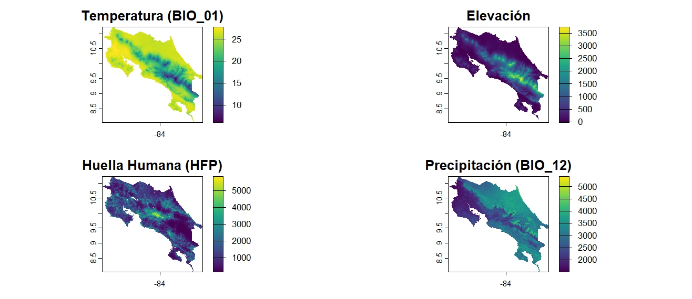

<link rel="stylesheet" href="style.css">

  

# Edna Orias Rodríguez

## Tropical Biology Student

I am a Tropical Biology student at the School of Biological Sciences, National University of Costa Rica. I am deeply passionate about conservation, environmental education, and biodiversity preservation. Since 2018, I have worked as a student assistant in the Botany Department, contributing to national plant inventories and participating in various wildlife monitoring initiatives.

---

## 🧪 Professional Experience

* Student Assistant in Botany – National University of Costa Rica (2018–Present)  
* Volunteer – Reptile Count at Lapa Verde Wildlife Refuge  
* Participant – National Amphibian and Reptile Count  
* Intern – Sea Turtle Monitoring at Playa Cabuyal with *The Leatherback Trust*  

---

## 📚 Projects

1. **National Plant Inventories**  
   Fieldwork and data collection for floristic surveys across Costa Rica.

2. **Wildlife Monitoring Initiatives**  
   Participation in reptile and amphibian counts and sea turtle conservation programs.

---

## 🎓 Education

* Graduate of Colegio Vilaseca – San Isidro de Heredia  
* Currently pursuing a Bachelor's degree in Tropical Biology – National University of Costa Rica  

---

## 🌍 Languages

* Spanish (native)  
* English (advanced)  

---

## 🎨 Hobbies

* Hiking  
* Reading  
* Drawing  
* Cooking  

---

## 📬 Contact Information

**GitHub:** [roedna](https://github.com/roedna)  

---
### 1. Occurrence Records of *Bothrops asper* in Costa Rica  
**Figure 1.** Pre-decline (red) and post-decline (blue) georeferenced records of *Bothrops asper* across Costa Rica. The map highlights spatial concentration in lowland areas and temporal shifts in distribution.

---

### 2. Ecological Niche Visualization  
**Figure 2.** Environmental niche of *B. asper* based on temperature, precipitation, and elevation. The graph shows clustering of post-decline records within the warm and humid core of the species’ realized niche.

---

### 3. Environmental Gradients Across Costa Rica  
**Figure 3.** Spatial distribution of key environmental and anthropogenic variables:  
A) Mean annual temperature (BIO_01)  
B) Annual precipitation (BIO_12)  
C) Elevation (DEM)  
D) Human Footprint Index (HFP)  
All layers are projected to the same reference grid and show gradients from low (dark tones) to high (light tones).

